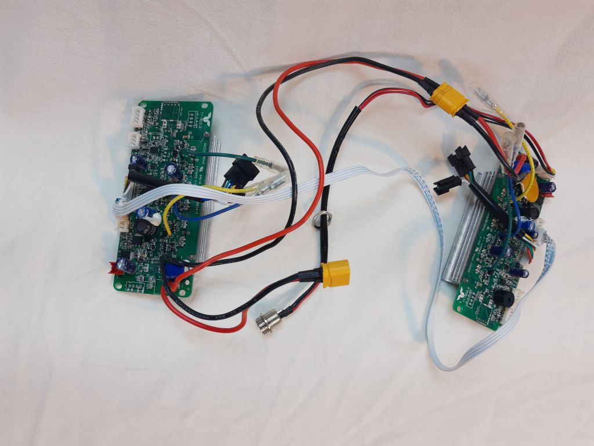
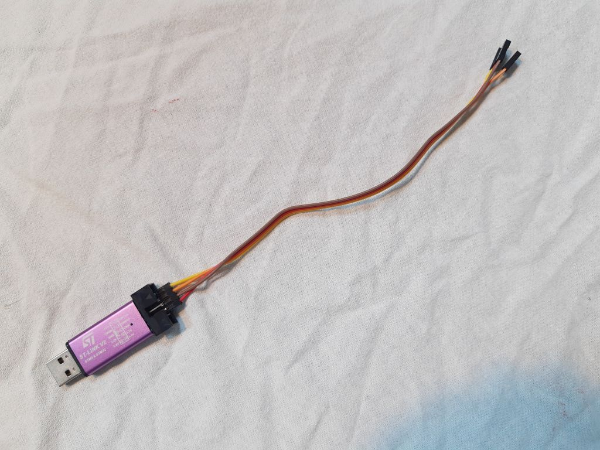
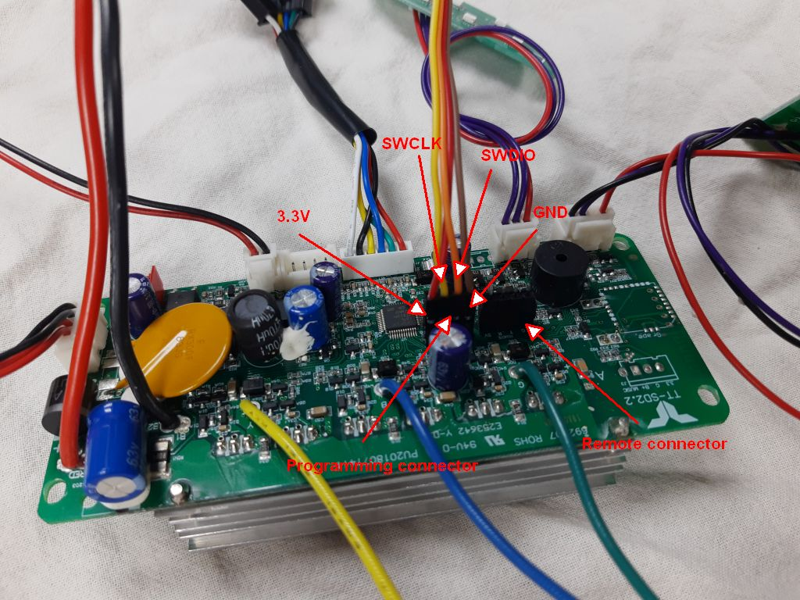
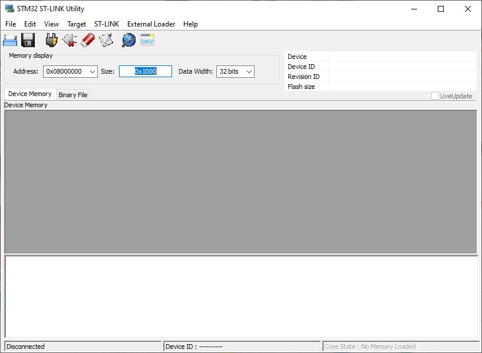
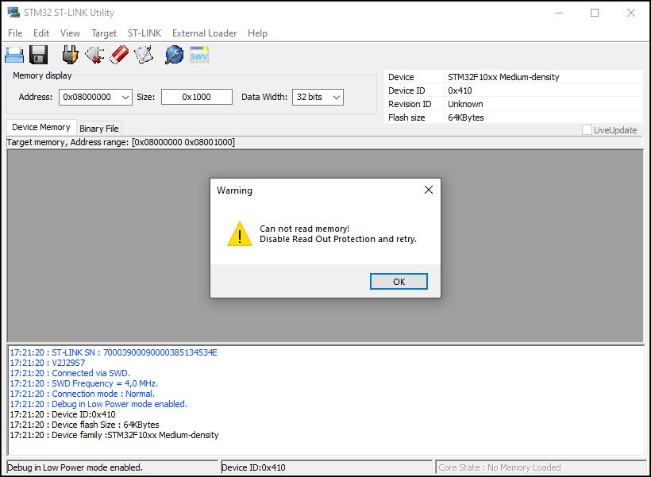
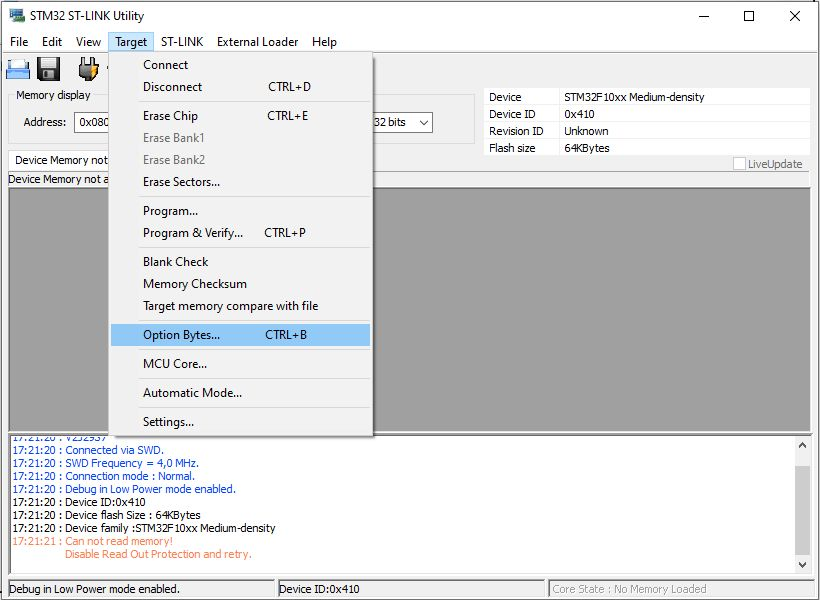
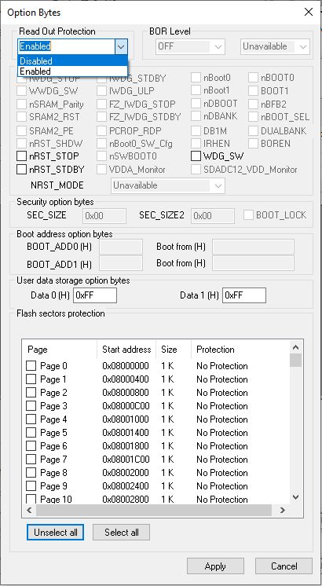

# Hoverboard controllers

This project currently makes the (probably incorrect) assumption you have exactly the same hoverboard controllers as I do, pictured below. They are marked TT-SD2.2 and fairly common but not universal.

This controller variant comes as two controllers which come as one controller per wheel, linked together with a UART connection (the flat grey cable in the picture below). The two controllers are very similar but not identical. The 'primary' controller has the connector for the on/off switch and charge socket while the 'secondary' doesn't, the ports are left unpopulated on the PCB.

You will need to carefully solder some pin headers to the ST-link programming port to re-flash them and also to the 'Remote' port which is a UART you can send commands to the controller.

For this project I am using [this fork](https://github.com/SimBil91/Hoverboard-Firmware-Hack-Gen2) of one of the common hoverboard controller firmware repositories, as it provides more control of the boards over the UART and more information back to the controlling device.

To reflash the controllers with the open source software you will need an ST-Link adapter, which are cheap and commonly available on eBay, Amazon and so on.

The Windows software for the ST-Link (STM32 ST-LINK Utility v4.6.0) is available here. You need this software to wipe and unlock the controller, prior to putting the new software on.

Connect the ST-Link to the programming connector on the controller as shown in the picture below. Do this carefully, using the 3.3v power connection (not 5v) and be sure not to reverse it otherwise the controller is likely to be destroyed.

When you connect the ST-Link to USB the speaker on the controller will make a very irritating noise, it's worth putting a piece of tape over the piezo sounder, which is the round black component with the hole in the top.

When you first start the ST-Link software you should see something like this. It's not connected to the controller yet.

To connect, choose 'Target' -> 'Connect', which should get you something like this.

This error means the firmware is protected against download and is entirely to be expected. You need to use the St-Link to unlock the device. This will wipe the firmware but that doesn't matter as we don't need it any more.

From the menu choose 'Target' -> 'Option Bytes' to unlock it.

In the popup that appears, choose 'Disabled' for 'Read Out Protection' and click Apply. This will wipe the onboard flash of the controller and unlock it. Every time I've done this it warns that it couldn't reset the controller, but after reconnecting it shows as wiped with all the memory set to 0xff.

Now it's possible to build the software and flash the controller. You should not need the ST-Link software again.